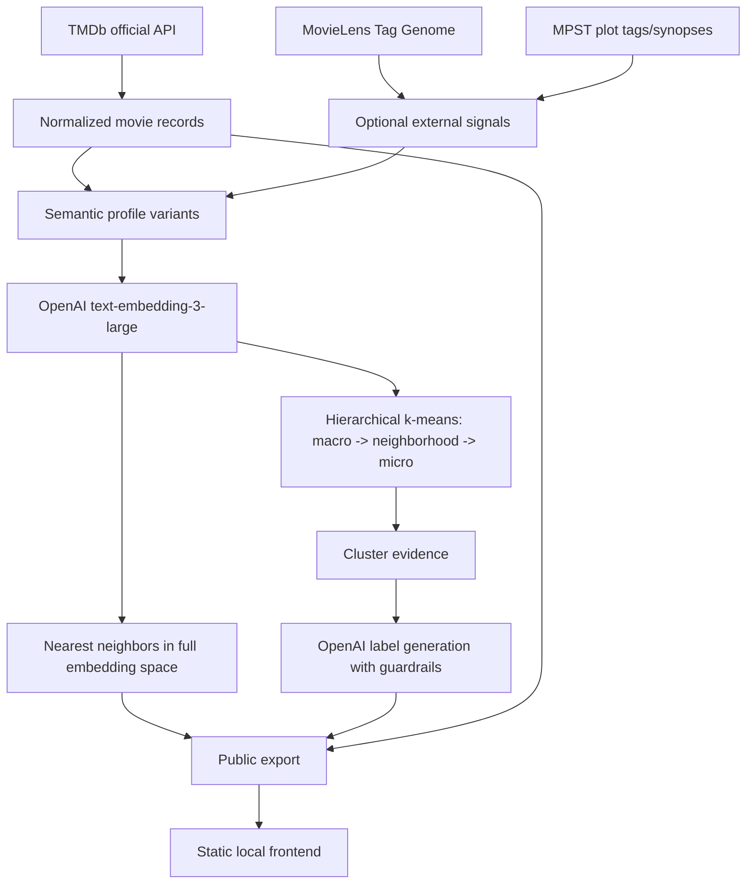

# The Film Atlas Data Implementation Report

## Purpose

The Film Atlas is a static, portfolio-ready movie topology system. The core
product idea is to map films by experiential similarity rather than by official
genre alone. The final public artifact should let a visitor search a film, see
where it lives in an emergent "vibe geography," inspect its macro,
neighborhood, and micro labels, and compare its nearest semantic neighbors.

This document summarizes the full data implementation path: what we first
built, what failed in the early atlas, the experiments that changed the
architecture, what finally worked, and what remains important for the UI/UX
phase.

The final validated data export is:

- `outputs/public_export`
- 10,000 films
- 16 macro clusters
- 180 neighborhoods
- 750 microclusters
- 946 generated labels
- 10,000 nearest-neighbor lists
- Static JSON only
- No API keys, embeddings, raw reviews, or private experiment fields in the
  public export

## Constraints

The project had several important constraints that shaped the implementation:

- Use legitimate data sources suitable for a public portfolio project.
- Do not scrape Letterboxd, IMDb, or other websites.
- Use TMDb through the official API.
- Use external public datasets only when they are locally cached and legally
  defensible for experimentation.
- Keep raw TMDb responses, private processed data, embeddings, raw reviews, and
  experiment intermediates out of the public export.
- Do not expose secrets or `.env` contents.
- Keep the public website architecture static: no backend service and no API key
  required in the browser.
- Avoid embedding fields that would make the semantic map mostly about era,
  country, language, cast, director, or production company.
- Preserve evocative labels. The goal was not a dry taxonomy like `Action
  Movie`; it was poetic-but-accountable discovered geography.

## Final Architecture

The final system has five layers:

1. Source data
2. Semantic profile construction
3. Embeddings and nearest neighbors
4. Hierarchical clustering and labeling
5. Sanitized static export and local frontend QA



The final map is built from high-dimensional semantic embeddings. The 2D map is
only a projection for display; the actual nearest-neighbor relationships and
clusters are computed in the full embedding space.

## Data Sources

### TMDb

TMDb remains the core source of movie identity and metadata. The pipeline uses
TMDb for:

- title
- year
- runtime
- rating/vote counts for display and optional status/tone probes
- overview
- tagline
- genres
- keywords
- IMDb ID for matching external datasets
- available TMDb user reviews as private profile input

TMDb reviews are useful, but coverage is uneven and many reviews are short,
generic, or production-focused. We used cleaned review language as one signal,
not as the backbone of the atlas.

### MovieLens Tag Genome

MovieLens Tag Genome became the strongest structured "vibe" addition. It
provides relevance-scored tags such as tone, genre flavor, narrative style, and
audience-perceived qualities.

Implementation details:

- Source file: `data/external/ml-25m.zip`
- Matching path: MovieLens `links.csv` maps MovieLens IDs to TMDb IDs.
- The loader keeps the highest-relevance tags above a threshold.
- Final 10k coverage: 6,843 / 10,000 films.

This source helped because it adds structured vibe language without scraping
reviews.

### MPST

MPST supplied fine-grained plot tags and optional longer plot-synopsis text.

Implementation details:

- Source file: `data/external/mpst_full_data.csv`
- Matching path: IMDb ID from TMDb normalized records.
- Final 10k coverage: 5,156 / 10,000 films.

MPST helped especially when TMDb overviews were thin. It also introduced some
risk because longer plot synopses can overweight literal plot mechanics. The
final selected variant used MPST, but with controlled synopsis length.

### Sources Avoided

Letterboxd and IMDb user reviews were intentionally not used as core data
sources. They are vibe-rich, but scraping them would be legally and technically
fragile for a public portfolio project. The final project is easier to explain:
it uses official API data, public datasets, embeddings, clustering, and
sanitized static export.

## Semantic Profile Construction

The central design problem was: what text should represent a movie before it is
embedded?

The earliest profile was thin:

- title
- overview
- genres
- keywords
- short review snippet

This was enough to produce promising neighbors, but it had three serious
weaknesses:

- title leakage
- false-specific labels
- weak nuance for films with short overviews

Examples of title leakage included:

- `Civil War` drifting toward Captain America films
- `Heat` risking confusion with `The Heat`
- `The Game` drifting toward `Game Night` or `Gamer`
- `Avatar` being vulnerable to same-title franchise gravity

The final profile experiments introduced richer and more controlled variants:

- `baseline_light`: early title-bearing profile style.
- `no_title_light`: title removed to reduce title leakage.
- `no_title_rich_reviews`: title removed, more TMDb review language included.
- `plot_keyword_tagline_reviews`: tagline, weighted overview/keywords, medium
  review language.
- `audience_vibe_rich`: heavier TMDb review language.
- `movielens_tag_genome`: MovieLens vibe tags added.
- `mpst_plot_tags`: MPST tags and synopsis added.
- `hybrid_external_vibes`: MovieLens + MPST + TMDb metadata.
- `tone_review_synopsis`: tone tags and longer review/synopsis signal.
- `hybrid_tone_status`: MovieLens + MPST + tagline + TMDb audience texture +
  tone/status probes.
- `status_overlay_probe`: status/rating signal tested separately.

The winning profile was `hybrid_tone_status`.

The key lesson was that more text is not automatically better. The useful
profile is not the longest profile; it is the profile that combines plot,
keywords, structured vibe tags, and light audience texture without letting any
one noisy source dominate.

## Review Language Findings

Earlier review-weight ablation showed that light review snippets helped more
than no reviews, but heavier review text could add noise.

On the 500-film ablation:

- `no_reviews`: coherence average 0.553, label confidence 0.643
- `light_reviews`: coherence average 0.560, label confidence 0.679
- `medium_reviews`: coherence average 0.560, label confidence 0.650

The conclusion was:

- light review language helps or preserves vibe discovery
- medium/heavy review language can drift toward reviewer opinion, actor names,
  production chatter, or generic praise
- reviews should remain texture, not the main semantic spine

This is why the final system used controlled TMDb audience texture plus
structured public tags instead of simply embedding lots of review text.

## Clustering Experiments

### Early Flat Clustering

The early milestone pipeline used embeddings plus k-means clusters. It worked
well enough to prove the concept. Neighbors often felt intuitive, and early
clusters were labelable.

However, the first public-feeling atlas had a hidden structural problem:
macro, neighborhood, and micro clusters were not truly nested. The UI implied a
country/state/city hierarchy, but the data model behaved more like three
independent lenses.

This caused contradictions such as:

- a movie's micro label fitting while the macro label was wrong
- a neighborhood having fewer movies than its microcluster
- labels seeming to float over unrelated points
- selected films showing hierarchy paths that did not feel telescoped

That was the most important architectural failure.

### Method Comparison

We compared:

- k-means
- agglomerative clustering
- graph/community clustering with NetworkX
- HDBSCAN

In the 500-film method comparison, k-means was the most labelable method.
HDBSCAN was useful as a comparator but not viable for this atlas: it collapsed
too much structure into outliers and broad clusters. The graph method produced
interesting communities but was too coarse for a public map. Agglomerative
clustering created too many tiny or unbalanced clusters.

Important early metrics:

- k-means: 35 clusters, coherence average 0.560, one tiny cluster
- graph: 9 clusters, too broad
- HDBSCAN: 2 clusters and 330 outliers
- agglomerative: many tiny clusters

The final system kept the k-means family, but changed the topology from
independent flat layers to strict hierarchy.

### Final Hierarchical K-Means

The final selected strategy was `hierarchical_kmeans`.

This means:

1. Cluster all films into macro regions.
2. Within each macro, cluster those films into neighborhoods.
3. Within each neighborhood, cluster those films into microclusters.

That guarantees every movie has a valid path:

```text
macro -> neighborhood -> micro
```

The final hierarchy has:

- 16 macro clusters
- 180 neighborhoods
- 750 microclusters
- 0 hierarchy mismatch
- 0 duplicate path-label movies after repair

The hierarchy is now real in the data, not just implied by the UI.

## Cluster Count Decisions

Cluster count was a product decision, not only a quantitative optimization.

The pipeline tested different granularities. Some smaller configurations scored
well quantitatively, but human QA showed that they could be too broad or regress
known cases. Larger configurations created more tiny clusters and more label
fragility.

For the final 10k dataset, the selected 16 / 180 / 750 hierarchy balanced:

- enough macro variety to avoid giant junk drawers
- enough neighborhoods to make search/audit meaningful
- enough microclusters to give specific vibe pockets
- tolerable tiny-cluster pressure
- readable public labels

This hierarchy should be rescanned when the project scales beyond 10k films.
The right number of clusters is dataset-size dependent.

## Labeling

The labeler had to solve a real tension:

- generic labels are accurate but boring
- poetic labels are memorable but can become false

The final rule became: labels should be poetic but accountable.

Label guardrails included:

- avoid specifics like `moon`, `arctic`, `space`, `alien`, `battlefield`,
  `witchcraft`, `heist`, or `rom-com` unless the evidence supports them
- use parent context when labeling child clusters
- make macro labels broad enough to cover all children
- make micro labels specific but not brittle
- preserve human-editable label artifacts and repair rules
- audit known bad cases after every structural change

The system still keeps vivid names, but no longer accepts fun labels that make
the atlas untrustworthy.

## Manual And LLM-Assisted Audit

The audit process mattered as much as the modeling.

The user manually reviewed films such as:

- `Office Space`
- `Avatar`
- `The Founder`
- `Vanilla Sky`
- `Final Destination`
- `Weapons`
- `Sully`
- `Mickey 17`
- `Rush Hour`
- `Barbie`
- `Her`
- `Juno`
- `Oppenheimer`
- `Sound of Metal`
- `The Abyss`
- `The Hunger Games`
- `The Lego Movie`

That review surfaced the real failure modes:

- false macro labels
- title leakage
- franchise gravity
- non-nested hierarchy
- micro labels that were too specific
- nearest neighbors that were good in high-dimensional space but confusing on a
  2D map

We then added structured audit tooling:

- known movie watchlist
- bad-neighbor pattern checks
- good-neighbor pattern checks
- duplicate parent-child label checks
- structural public-export scans
- large LLM-assisted audit over public export only
- parallel audit workers for faster reruns

The final audit evidence:

- full 10k audit before targeted repair pass: 9,633 pass / 336 mixed / 31 fail
- recheck of the 31 full-audit failures after repair rules: 22 pass / 9 mixed /
  0 fail
- final strict 1k sample before the last targeted wording repair: 900 pass / 99
  mixed / 1 fail
- the final one-off failure, `Excess Baggage`, was repaired by broadening the
  affected macro from a teen-only frame to a youth/crime-scheme comedy-drama
  frame

We intentionally stopped repeated reruns after that. At that point, continuing
to optimize against one random sampled failure would have overfit the audit
loop rather than improving the product.

## Public Export

The public export is the boundary between the private pipeline and the static
website.

Files:

- `movies.json`
- `points.json`
- `neighbors.json`
- `labels.json`
- `macro_clusters.json`
- `neighborhood_clusters.json`
- `micro_clusters.json`
- `manifest.json`

The export contains:

- public movie display metadata
- 2D projected positions
- cluster IDs
- generated labels and descriptions
- nearest-neighbor lists
- hierarchy metadata

The export does not contain:

- API keys
- bearer tokens
- raw reviews
- raw TMDb responses
- embeddings
- external synopsis text
- private experiment fields

The final manifest reports:

- movie count: 10,000
- projection method: UMAP
- macro labels: 16
- neighborhood labels: 180
- micro labels: 750
- privacy flags: no API keys, no embeddings, no raw reviews

## What Worked

### 1. Official TMDb data was enough for the foundation

TMDb gave us reliable identity, overview, keywords, genres, runtime, ratings,
reviews, and IMDb IDs for matching.

### 2. Structured vibe tags improved the profiles

MovieLens Tag Genome was especially valuable because it added audience-vibe
language in a structured, defensible way.

### 3. MPST helped fill plot-depth gaps

MPST added longer synopsis and tag signal where TMDb metadata was thin, while
IMDb ID matching kept the join safer than fuzzy title matching alone.

### 4. Hierarchical clustering fixed the biggest data-model problem

The early atlas looked like a hierarchy but was not one. Rebuilding as a true
macro -> neighborhood -> micro hierarchy made the system much more coherent.

### 5. Audit tooling turned subjective frustration into actionable repairs

Voice-note audits became structured failure modes. The combination of human
spot checks, known controls, and LLM-assisted large audit was much better than
trusting aggregate metrics.

### 6. Repair rules were useful when applied sparingly

Some edge cases are hard for pure clustering: duplicate titles, franchise
remakes, live-action/animation hybrids, and movies whose plot keywords pull
them sideways. Small title-anchored repairs cleaned up egregious public-facing
errors without changing the entire clustering model.

## What Did Not Work

### 1. Independent macro/neighborhood/micro clustering

This was the main failure. It created contradictions and made the UI promise a
hierarchy that the data could not support.

### 2. Title-heavy embeddings

Titles helped obvious franchise matches, but they also caused leakage. The final
profile architecture treats title signal carefully and relies more on metadata,
tags, plot, and audience texture.

### 3. Heavy review text

More review language did not automatically mean better vibes. Heavier review
profiles increased noise risk.

### 4. HDBSCAN

HDBSCAN was not a good fit for this dataset and product goal. It produced too
many outliers and too little labelable structure.

### 5. Pure quantitative optimization

Some cluster counts looked good numerically but failed known-case audits. Human
QA was necessary because this product is about whether the map feels
intuitively right.

### 6. Treating the 2D map as literal geometry

UMAP is a projection, not a geographic contract. It can preserve many local
relationships while distorting others. This matters for the next UI phase.

## Key Pivots

### Pivot 1: From "more data will fix it" to "the hierarchy is structurally wrong"

The first instinct was to scale up or add data. The audit showed that the
largest problems were structural: non-nested layers, title leakage, and label
overreach.

### Pivot 2: From flat labels to telescoping labels

Labels needed to make sense as a path. A macro should be broader than a
neighborhood, and a neighborhood should be broader than a microcluster.

### Pivot 3: From review-rich profiles to balanced hybrid profiles

Reviews were useful, but not enough. The final approach combined TMDb metadata,
MovieLens tags, MPST tags/synopsis, tone/status probes, and controlled audience
texture.

### Pivot 4: From one-shot validation to audit/repair cycles

The atlas improved because failures were categorized and repaired based on
patterns:

- label repair
- point reassignment
- neighbor repair
- title collision fix
- duplicate path-label fix

### Pivot 5: From pipeline-only thinking to product-facing trust

The question became not just "does the model cluster?" but "can a visitor click
a known film and trust what they see?"

## Final Winning Approach

The final selected approach:

- profile variant: `hybrid_tone_status`
- clustering: `hierarchical_kmeans`
- embedding model: `text-embedding-3-large`
- label/audit model: `gpt-4.1-mini`
- projection: UMAP
- movie count: 10,000
- hierarchy: 16 / 180 / 750
- label count: 946
- same-micro nearest-neighbor top-7 rate: 58.4%
- coherence average: 0.647
- classification run reported cost: $4.6826
- final public export: `outputs/public_export`

Tracked API spend remained under the user's updated $30 budget. The largest
reported costs were the final classification run and the full 10k audit pass;
smaller targeted and sampled audits were used for repair validation.

## Verification

Final close-out checks:

- `uv run pytest`: 60 passed
- `uv run ruff check .`: passed
- `pnpm build` in `frontend/`: passed
- browser QA on `http://127.0.0.1:4322/film-atlas/`: passed
- public export structural scan: 10,000 movies / 10,000 points / 10,000 neighbor
  lists
- duplicate path-label movies: 0
- privacy scan: no API keys, embeddings, or raw reviews in public export

## Interpretation Of The Current Map

The data classification system has succeeded. The remaining confusion is mostly
UI/geometry, not underlying classification.

The current 2D map is a UMAP projection of high-dimensional movie embeddings.
Nearest neighbors are computed in the original embedding space, but the visual
positions are displayed in a compressed 2D plane. Because of that, it is
possible for:

- a nearest neighbor to appear far away on screen
- a microcluster to look visually stretched or split
- a label to sit near the centroid but not near every member
- a cluster to be semantically real but geographically unintuitive

This is normal for projection-based maps. It is also exactly why the UI should
not rely only on raw 2D distance to communicate membership.

## Recommended UI Direction

The next UI phase should treat the current map as one useful mode, not the only
possible representation.

### Mode 1: Semantic Projection

This is the current UMAP-style view.

Strengths:

- shows broad semantic gradients
- preserves many local similarities
- feels organic and exploratory
- good for "movie galaxy" discovery

Weaknesses:

- clusters are not guaranteed to be contiguous
- nearest neighbors can appear far away
- labels can float in unintuitive places
- nested hierarchy is not visually obvious

### Mode 2: Atlas Territory Map

This is the direction that matches the product metaphor better.

Goal:

- macro regions are countries
- neighborhoods are states/provinces inside those countries
- microclusters are towns/cities inside those neighborhoods
- movies live inside their micro territory

This would require a cluster-aware layout, not a pure UMAP scatterplot.

A good approach would be:

1. Use high-dimensional embeddings to compute distances between macro clusters.
2. Lay out macro regions as large territories.
3. Within each macro, lay out neighborhoods using their local relationships.
4. Within each neighborhood, lay out microclusters.
5. Within each microcluster, place movies using local similarity.
6. Draw territory boundaries using hulls, Voronoi cells, or packed regions.
7. On click, show both nearest semantic neighbors and same-territory members.

This sacrifices some global projection fidelity, but it makes the atlas metaphor
much clearer.

### Recommended Product Compromise

The best next version should probably support both concepts:

- `Map` or `Territory` mode: cluster-contiguous, nested, country/state/city
  metaphor
- `Constellation` or `Similarity` mode: current UMAP projection, optimized for
  semantic distance and discovery

The selected-film panel should also make the distinction explicit:

- nearest neighbors: "semantically closest films"
- same microcluster: "films in this exact discovered territory"
- same neighborhood: "nearby towns in the same region"

That would resolve the current confusion where "nearest neighbor" and "same
cluster" feel like they should always mean the same visual thing.

## Remaining Risks

The data system is strong enough for portfolio review, but the following risks
remain:

- Some broad labels still have mild edge-case imprecision.
- Some franchise-heavy pockets may remain visually dominant.
- The 2D projection can still confuse users unless explained or redesigned.
- Cluster counts should be rescanned when scaling beyond 10k films.
- The public article should be honest that this is a semantic atlas, not a
  perfect ontology.

## Bottom Line

The final data implementation works because it stopped treating The Film Atlas
as a simple embedding demo and rebuilt it as a full pipeline:

- defensible data sources
- richer profiles
- controlled review usage
- external vibe tags
- true hierarchy
- evidence-based labeling
- large-scale audit
- targeted repair rules
- sanitized static export

The classification system is now successful. The next big opportunity is not
more data repair; it is UI/UX: making the hierarchy legible, making map geometry
match user expectations, and turning the atlas metaphor into something visitors
can understand immediately.
