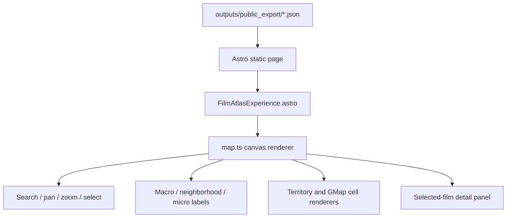

# The Film Atlas UI/UX Implementation Report

## Purpose

This document summarizes the UI/UX implementation work for The Film Atlas. It
is intended to support the eventual public technical writeup by preserving the
actual design path: what the interface needed to communicate, what early
versions got wrong, which experiments were tried, which fixes worked, and how
the final local frontend is structured.

The UI/UX work was not only a visual polish pass. The core challenge was
representational honesty: the page needed to look like a map without implying
false semantic relationships. A beautiful map of bad or misleading structure
would hurt the project. The final interface therefore treats cartography,
labels, color, interaction, and audit tooling as part of the same product
problem.

The current local frontend reads the sealed public export:

- `outputs/public_export`
- 10,000 films
- 16 macro clusters
- 180 neighborhoods
- 750 microclusters
- 946 total labels
- static JSON only
- no API keys, embeddings, or raw reviews in the browser payload

## Final UX Thesis

The final Film Atlas UI is a static, browser-rendered semantic map of movies.
Each dot is one film. The map lets a visitor search, pan, zoom, inspect a film,
see its macro/neighborhood/micro identity, expand each layer to review peer
movies, and compare nearest neighbors.

The product-facing representation is no longer a raw 2D embedding scatterplot.
The winning direction is an atlas-style semantic territory view:

- macro clusters behave like countries
- neighborhoods behave like regions or states
- microclusters behave like towns or local districts
- movie dots stay inside the visual territory implied by their cluster
- labels stay stable while panning and zooming
- boundaries and colors expose the active semantic tier

The map still depends on semantic embeddings and nearest-neighbor evidence, but
the UI presents that evidence through a readable territory system rather than a
bare projection.

## Design Principles

### 1. Semantic Honesty Over Decoration

The user feedback that shaped the project most strongly was that the map should
not merely look like a map. Region adjacency, containment, labels, and dot
placement should be accountable to the semantic system behind the clusters.

This ruled out several tempting shortcuts:

- decorative blobs around arbitrary centroids
- curved borders that were not tied to semantic relationships
- overlapping territory fills that looked organic but implied false geography
- labels that floated to empty screen space far from their actual region
- projection views that were technically interesting but hard to read as a
  consumer product

### 2. Reversible Experiments

The frontend evolved through many visual experiments. A repeated requirement
was to keep alternatives available long enough to compare them, instead of
silently replacing one look with another.

This produced two separate controls:

- `Map layout`: chooses the underlying semantic layout geometry.
- `Render model`: chooses how that geometry is drawn.

That separation matters. It lets the same semantic layout be reviewed through
different visual treatments, and it prevents the UI from confusing a data
layout decision with a styling decision.

### 3. Browser QA Is Part Of Done

The UI repeatedly looked acceptable from code alone and then failed under real
browser inspection. The final workflow therefore treats local browser QA as a
first-class implementation step.

The recurring verification loop became:

- run `pnpm build` in `frontend/`
- run `/Users/davidlisk/.local/bin/uv run ruff check .`
- run `/Users/davidlisk/.local/bin/uv run pytest`
- open `http://127.0.0.1:4322/film-atlas/`
- inspect macro, neighborhood, and micro zoom states
- test selection, nearest neighbors, labels, colors, and reset state
- check the browser console for errors and warnings
- save screenshot artifacts under `outputs/reports/`

### 4. The UI Should Help Audit The Data

The frontend is not just the final presentation layer. It became the main tool
for qualitative auditing. This is why the selected-film panel exposes:

- movie title, year, runtime, rating, genres, and overview
- macro, neighborhood, and micro labels
- expandable same-cluster peer lists
- nearest-neighbor buttons
- selected-neighbor recentering

This turned subjective review into a faster loop: click a film, see whether its
labels make sense, inspect nearby films, inspect same-cluster films, and report
where hierarchy or labeling feels wrong.

## Current Frontend Architecture

The local frontend lives inside this repository under `frontend/`. It is a
static Astro page backed by public JSON.

Primary files:

- `frontend/src/pages/film-atlas.astro`
- `frontend/src/layouts/AtlasLabLayout.astro`
- `frontend/src/components/film-atlas/FilmAtlasExperience.astro`
- `frontend/src/lib/film-atlas/map.ts`
- `frontend/src/lib/film-atlas/types.ts`

The app reads:

- `outputs/public_export/movies.json`
- `outputs/public_export/points.json`
- `outputs/public_export/neighbors.json`
- `outputs/public_export/labels.json`
- `outputs/public_export/macro_clusters.json`
- `outputs/public_export/neighborhood_clusters.json`
- `outputs/public_export/micro_clusters.json`
- `outputs/public_export/manifest.json`
- `outputs/public_export/territory_layouts.json`

The browser receives only static JSON and frontend code. It does not call TMDb,
OpenAI, or any backend service.



## Data Contract For The Visual Layer

The early frontend could draw movie points and labels from `points.json`, but it
could not honestly present a country/state/city style atlas. The UI needed more
geometry than a point cloud.

The territory work added `territory_layouts.json` to the public export. This
file contains six layout variants:

| Variant id | UI label | Purpose |
| --- | --- | --- |
| `semantic_gmap_cells` | `Semantic Cells` | Default GMap-inspired semantic cell layer with movie-level cells. |
| `semantic_graph_balanced` | `Semantic Territory - Balanced` | Graph-driven semantic territory layout with moderate spacing. |
| `semantic_graph_compact` | `Semantic Territory - Compact` | Denser comparison layout. |
| `semantic_graph_spacious` | `Semantic Territory - Spacious` | Looser comparison layout with more breathing room. |
| `semantic_umap_anchored` | `Semantic Territory - UMAP Anchored` | Keeps stronger pull toward the original projection. |
| `legacy_packed_baseline` | `Legacy Packed Baseline` | Earlier packed layout kept as a control. |

Each variant provides:

- movie point positions
- macro, neighborhood, and micro region centers/radii
- metrics for weighted semantic neighbor distance
- optional movie-level GMap cells

The default `semantic_gmap_cells` variant includes 10,000 movie-level cells.
Each cell includes:

- `tmdb_id`
- `macro_id`
- `neighborhood_id`
- `micro_id`
- polygon vertices

That is what allows the final cell-border renderer to fill the map with movie
cells, hide same-cluster internal edges, and draw only the active semantic
boundary level.

## Layout Generation

The offline layout engine lives in `film_atlas/territory_layout.py`.

It began as a way to make the map look more like an atlas, but the important
shift was from packing-first geometry to graph-aware geometry.

The layout generator now combines:

- original semantic projection coordinates
- macro/neighborhood/micro hierarchy
- nearest-neighbor links
- semantic graph stress forces
- parent-child containment
- radius estimates from cluster size
- optional movie-level Voronoi cells for GMap rendering

The generator writes `outputs/public_export/territory_layouts.json` and updates
the public manifest.

The test coverage in `tests/test_territory_layout.py` verifies that:

- the layout file is generated
- all six variants are present
- every variant preserves the movie set
- cluster nesting is represented in region records
- GMap cells include the required IDs and polygons
- the manifest advertises `territory_layouts.json`

## Render Model Evolution

### Raw Projection

The original map behaved like a semantic scatterplot. This had real analytical
value, but it was not the right product-facing default.

Problems:

- nearest neighbors could appear far apart after projection distortion
- labels floated near dense clouds but did not form readable territories
- users expected map-like containment once the UI used macro/neighborhood/micro
  language
- the visual metaphor implied more geographic structure than the raw projection
  could support

The projection remains useful as a fallback or expert view, but not as the main
portfolio experience.

### Packed And Organic Territory Experiments

Several early territory renderers attempted to make cluster areas visible:

- strict packed atlas
- hybrid micro islands
- semantic territory fills
- organic territory
- biological cell model

These experiments were useful, but they exposed a key failure mode: attractive
shapes can still be semantically misleading.

Examples of failed directions:

- regions overlapped in ways real territories do not
- borders were curved decoratively rather than derived from semantic adjacency
- cells became parallelogram-like or overly synthetic
- dots clustered in one corner of a territory while the rest of the cell was
  empty
- changing zoom tiers moved dots or implied that a movie changed location

The final approach kept the useful lessons and removed the misleading parts.

### Tessellated Territory Cells

The next pass used nested territory cells so macro, neighborhood, and micro
regions could fill available space without overlap. This improved the atlas
metaphor because regions became contiguous and nested.

However, tessellation by region centers still had limitations:

- center placement had to be semantically meaningful before borders could be
  trusted
- curved borders alone did not solve bad adjacency
- point placement needed to use available cell space without letting dots cross
  borders

### GMap-Inspired Cell Renderer

The strongest renderer became the GMap-inspired cell layer.

The idea:

1. Start from graph-driven semantic movie positions.
2. Generate one finite cell per movie.
3. Color cells by cluster membership.
4. Hide same-cluster internal boundaries.
5. Draw only boundaries where the active semantic tier changes.

This makes the map legible at three levels:

- macro zoom: macro country boundaries
- neighborhood zoom: neighborhood boundaries inside macro context
- micro zoom: micro boundaries inside neighborhood context

It also solves several earlier UX problems:

- every film dot remains inside its own semantic cell
- macro/neighborhood/micro boundaries are derived from movie membership
- zoom tier changes reveal more structure without moving the underlying movie
  geography
- no overlapping territory fills are required
- the map reads as a continuous surface rather than separate bubbles

The default render model is now `Cell borders`.

## Current Render Modes

The render dropdown currently exposes:

| Render mode | Role |
| --- | --- |
| `Cell borders` | Default GMap-inspired map. Best current product view. |
| `Territory map - clean` | Clean weighted-territory rendering for comparison. |
| `Organic territory` | Smooth shared borders, useful for cartographic comparison. |
| `Coastal territory` | More map-like outer coastline. |
| `Dense coast` | Stronger coastline and fuller point spread. |
| `Biological cells` | Preserves earlier organic-cell look as a reversible control. |

The key product decision is that `Cell borders` earned the default slot because
it best balances map readability, semantic honesty, and stable interaction.

## Interaction Model

### Search

The search box supports title/year/label/genre matching. Results are ranked so
exact title matches come first, then title prefixes, then substring matches,
then broader search text.

Selecting a search result:

- selects the film
- recenters the map
- keeps or increases zoom to an inspection-friendly level
- updates the selected-film panel
- draws nearest-neighbor connection lines

### Hover

Hovering a dot shows a tooltip with:

- title
- year
- primary label context

The hover target uses an adaptive hit radius so small dots remain usable.

### Selection

Clicking a dot selects it. The selected film:

- gets a stronger visual ring
- becomes the source for nearest-neighbor lines
- populates the right-side details panel
- exposes its macro, neighborhood, and micro labels
- exposes nearest-neighbor buttons

Clicking blank space clears the selection.

### Nearest Neighbors

The selected-film panel displays the nearest semantic neighbors with year and
similarity score. Clicking a neighbor selects and recenters that neighbor.

This was important for auditing because nearest neighbors often diagnosed
whether the embedding was working even when labels were questionable.

### Expandable Cluster Cards

The macro, neighborhood, and micro cards in the selected-film panel can expand
to show other movies in the same cluster.

This helped with two tasks:

- user-facing exploration
- cluster audit

The UI highlights the current movie in the peer list and lets the user select
another peer from the same cluster.

### Pan, Wheel Zoom, Buttons, And Touch

The canvas supports:

- drag panning
- wheel/trackpad zoom
- zoom-to-pointer behavior
- two-pointer pinch zoom
- zoom in/out buttons
- reset button

The zoom tier controls which label layer is active:

- macro below neighborhood threshold
- neighborhood in the middle band
- micro at close zoom

The max zoom was increased to make dense microcluster inspection practical.

## Label System

Labels were one of the hardest UX pieces because they need to be readable,
stable, and semantically honest.

### Early Label Problems

The first label approaches had several issues:

- labels overlapped heavily
- labels were hidden too aggressively
- labels shifted while panning or zooming
- macro labels disappeared at full zoom-out
- micro labels appeared far from the cells they described
- leader/ghost lines from labels to centroids looked visually noisy
- long labels were truncated or forced into awkward one-line text

### Stable World-Space Labels

The most important label fix was removing viewport-dependent screen-space
solving. Earlier versions tried to prevent overlap by recomputing positions in
screen space. That made labels "fly" as the user panned.

The current approach keeps label placement deterministic in world coordinates.
This is closer to how labels feel in a real map: a town name can fade in or out
with zoom, but it should not keep relocating while the map moves.

### Macro Labels

Macro labels are always drawn in macro view. The macro layer no longer skips
labels because of collision filtering. Font size gently caps down at the
furthest zoom-out levels so all 16 macro labels remain visible without
dominating the map.

### Neighborhood Labels

Neighborhood labels use collision filtering at broader views, then become more
permissive at inspection zoom. They are slightly larger than early versions to
improve readability.

### Micro Labels

Micro labels required several additional passes.

The final micro behavior:

- allows more labels at high zoom
- increases maximum zoom so dense areas can be inspected
- anchors visible micro labels to their actual cells
- uses GMap cell-union candidate placement for the `Cell borders` render mode
- chooses deterministic positions from inside the cluster's visible territory
- penalizes overlap with already placed labels in world coordinates
- avoids dynamic screen-space reshuffling

This fixed cases where a micro label had open space in its own cell but still
overlapped a neighboring label because the raw cluster centroid was in an
unhelpful place.

### Label Lines Removed

Leader lines between labels and centroids were removed. They made the map feel
like a diagram rather than an atlas and added visual noise without solving the
real placement problem.

## Color System

The map supports three color modes:

| Color mode | Purpose |
| --- | --- |
| `Macro colors` | Cleanest high-level palette. |
| `Neighborhood shades` | Stronger variation within each macro family. |
| `Micro shades` | Most granular point variation for close inspection. |

The color system is intentionally hierarchical:

- macro colors define the base palette
- neighborhood colors shift hue/saturation/lightness within a macro family
- micro colors derive from neighborhood shades

This avoids pure rainbow noise while still making lower-level structure visible.

One bug was caught during this pass: the first `Micro shades` implementation
tried to parse an HSL string as if it were a hex color, causing invalid canvas
colors and an almost black map. The fix introduced explicit HSL objects and a
single `hslToCss` conversion path.

Another design fix was tiered boundary coloring. In `Micro shades`, movie dots
can use micro-level variation, but macro and neighborhood borders keep colors
appropriate to their own tier. This prevents macro boundaries from becoming
random micro-colored noise.

## Ghost-Line And Boundary Fixes

A late-stage visual bug showed very fine internal "ghost lines" inside
microclusters. The cause was a per-movie cell stroke originally added to hide
anti-aliased seams between filled cells.

At micro zoom, that seam-hiding stroke became visible as a web of internal
movie-cell lines. The fix removed the per-cell fill stroke and left boundary
drawing to the explicit active-tier boundary renderer.

The current `Cell borders` model draws:

- macro boundaries at macro zoom
- macro plus neighborhood boundaries at neighborhood zoom
- macro plus neighborhood plus micro boundaries at micro zoom

It does not draw same-cluster internal movie-cell seams.

## Visual Layout And Page Structure

The frontend presents the experience as an interactive tool rather than a
marketing page.

The first screen contains:

- project title and short framing
- film count
- region count
- export date
- search
- layout selector
- render selector
- color selector
- active tier pill
- zoom/reset controls
- canvas map
- selected-film panel

This follows the product direction: the map itself is the experience. The page
does not force the user through a landing page before they can explore.

The methodology section below the map explains:

- each dot is a movie
- the page reads static public JSON
- the map is built from public metadata, layered clustering, and semantic
  territory layout
- TMDb is used as a data source but does not endorse the project

## What Worked

### Static JSON Architecture

The static architecture works well for the portfolio goal. It is fast, easy to
deploy, and safe because no secrets or private pipeline artifacts need to ship.

### GMap Cell Borders

The GMap-inspired renderer is the strongest current representation. It solves
the core problem of making clusters look like territories while keeping every
film attached to a real cell.

### Reversible Controls

Separate layout, render, and color controls made iteration much safer. The
project could compare variants honestly instead of replacing one fragile
assumption with another.

### Human-In-The-Loop Browser QA

The best fixes came from looking at real films and real labels in the browser.
Examples included:

- `Office Space` exposing classification/label issues earlier in the project
- `Call Me by Your Name` exposing misleading adjacency in packed layouts
- spy-thriller microclusters exposing poor label anchors
- macro zoom exposing disappearing labels
- `Micro shades` exposing a real color parsing bug

### Expandable Cluster Cards

The selected-film panel became a useful audit tool once it exposed cluster
members. This made it easier to tell whether a label issue was truly a data
problem, a hierarchy problem, or only a map-placement problem.

## What Did Not Work

### Raw Projection As Product Default

The projection view can be technically honest, but it does not read well enough
as the public default. Projection distortion makes some nearest neighbors appear
far apart, and users naturally interpret a map as territory.

### Decorative Organic Borders

Curving borders without fixing semantic adjacency was misleading. The map can
look more organic while becoming less truthful.

### Screen-Space Label Solvers

Screen-space label collision solvers prevented overlap in a static screenshot
but made labels shift during pan/zoom. This felt broken. Stable world-space
placement worked better.

### Over-Aggressive Label Hiding

Collision filtering kept the map clean, but it also hid micro labels even at
maximum zoom. The final approach relaxes culling as the user enters inspection
mode.

### Per-Movie Cell Hairlines

Same-color strokes around each movie cell were intended to hide seams, but they
became visible as ghost lines at micro zoom. Explicit tier boundaries are
cleaner.

## Current Known Tradeoffs

The UI is now strong enough for portfolio review, but the map still has honest
tradeoffs:

- The 2D map is still an interpretation of high-dimensional semantic structure.
- Boundaries are derived from layout geometry and cluster membership, not an
  absolute truth about film meaning.
- Label placement is deterministic and cell-aware, but still heuristic.
- Dense areas may require zooming and panning to read every micro label.
- `Micro shades` is useful for inspection but may be too visually busy as a
  default.
- Browser search QA through automation had a local virtual-clipboard issue,
  although manual search behavior remains part of the app.

## Final Implementation Surface

### Offline Layout

- `film_atlas/territory_layout.py`
- `tests/test_territory_layout.py`
- `outputs/public_export/territory_layouts.json`
- `outputs/public_export/manifest.json`

### Frontend Page

- `frontend/src/pages/film-atlas.astro`
- `frontend/src/layouts/AtlasLabLayout.astro`
- `frontend/src/components/film-atlas/FilmAtlasExperience.astro`

### Canvas Renderer

- `frontend/src/lib/film-atlas/map.ts`

Key renderer responsibilities:

- data loading
- layout option population
- render-mode population
- color-mode population
- pan/zoom/touch handling
- movie selection and hover
- search result ranking
- nearest-neighbor lines
- selected-film panel rendering
- expandable cluster disclosure lists
- territory cell construction
- GMap boundary indexing
- label placement
- point drawing
- color shading

### Type Contract

- `frontend/src/lib/film-atlas/types.ts`

Key exported types:

- `FilmAtlasManifest`
- `FilmAtlasMovie`
- `FilmAtlasPoint`
- `FilmAtlasLabel`
- `FilmAtlasCluster`
- `FilmAtlasNeighborRecord`
- `FilmAtlasTerritoryLayouts`
- `FilmAtlasTerritoryVariant`
- `FilmAtlasGmapCell`

## Verification Commands

The current verification suite is:

```bash
pnpm build
/Users/davidlisk/.local/bin/uv run ruff check .
/Users/davidlisk/.local/bin/uv run pytest
```

During the UI iteration, the local browser target was:

```text
http://127.0.0.1:4322/film-atlas/
```

Representative screenshot artifacts include:

- `outputs/reports/frontend_color_mode_micro_tiered_macro.png`
- `outputs/reports/frontend_color_mode_micro_tiered_micro.png`
- `outputs/reports/frontend_labels_macro_stable_final_fullpage.png`
- `outputs/reports/frontend_labels_macro_stable_min_zoom_fullpage.png`
- `outputs/reports/frontend_micro_labels_cell_placement_pass.png`
- `outputs/reports/gmap_cells_macro.png`
- `outputs/reports/gmap_cells_neighborhood.png`
- `outputs/reports/gmap_cells_micro.png`
- `outputs/reports/cartography_dense_coast_macro.png`
- `outputs/reports/cartography_dense_coast_micro.png`

## Suggested Technical Writeup Angle

The strongest story for a portfolio writeup is not "I made a movie scatterplot."
It is:

> I built a static semantic map of 10,000 films where the frontend had to turn
> high-dimensional embeddings, hierarchical clusters, and nearest-neighbor
> evidence into an explorable map without lying about the data.

The writeup should emphasize:

- the difference between embedding similarity and map geography
- why raw projections are not enough for a consumer-facing atlas
- how user audit exposed representational bugs
- how the frontend became a QA tool for the data pipeline
- why GMap-style cells were a better fit than decorative blobs
- how stable labels, tiered boundaries, and reversible controls made the map
  more trustworthy
- how the final architecture remains static, cheap, safe, and portfolio-ready

## Summary

The UI/UX work transformed The Film Atlas from a promising semantic scatterplot
into a map-like exploratory interface. The final system keeps the project
static and browser-safe, but gives users a richer way to inspect film
similarity: nested semantic territories, stable labels, tier-aware boundaries,
expandable cluster evidence, nearest-neighbor navigation, and reversible visual
controls.

The biggest lesson is that a semantic atlas is not just a visualization. It is
a contract with the user. If the interface says "this film lives here," the map
needs to make that claim carefully. The final UI is built around that standard.
