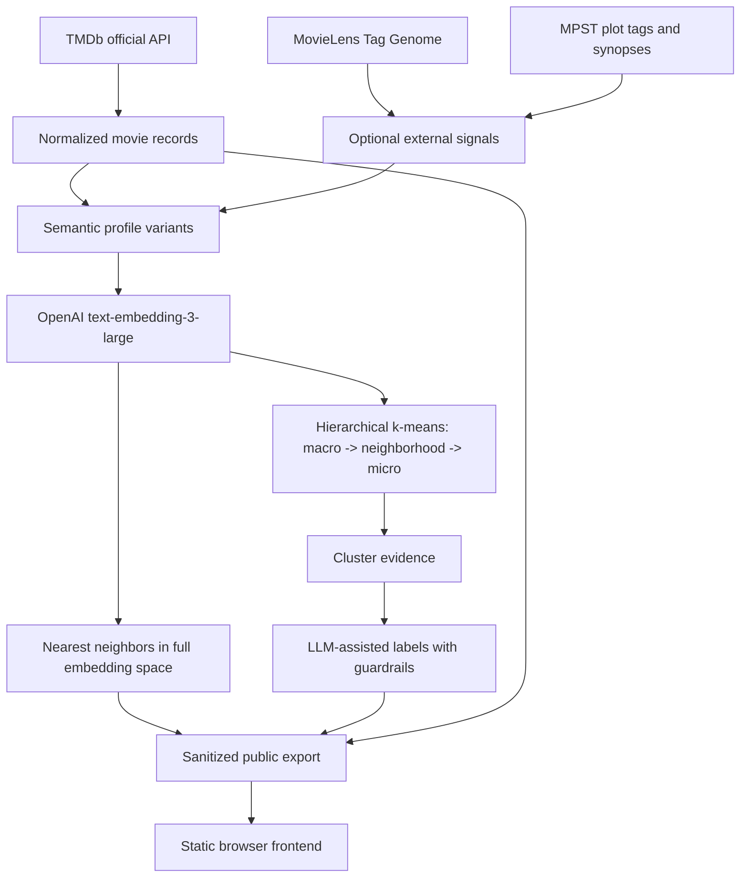
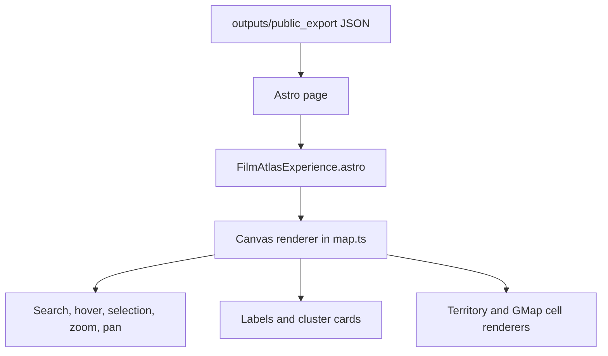

# The Film Atlas - Compact Technical Writeup Reference

This is the single-file compact reference for writing the technical post about
The Film Atlas. It condenses the numbered technical reference pack into one
ChatGPT-friendly source document.

Use this as source material, not final article prose. It preserves the project
story, major technical decisions, experiment results, validation numbers, UI/UX
evolution, and suggested writeup framing.

## Source Files Condensed

This file summarizes:

- `01_project_brief.md`
- `02_data_implementation_report.md`
- `03_ui_ux_implementation_report.md`
- `04_milestone_5_exploratory_classification_upgrade.md`
- `05_gmap_territory_engine_plan.md`
- `06_milestone_5_final_validation.md`
- `07_milestone_5_report.md`
- `08_milestone_5_deep_audit.md`
- `09_milestone_5_large_audit_2k_final.md`
- `10_milestone_5_prior_fail_recheck.md`
- `11_milestone_5_bucket_scan.md`
- `12_review_ablation_report.md`
- `13_clustering_method_comparison.md`
- `14_cluster_sweep_report.md`
- `15_cluster_label_review.md`
- `16_cluster_label_candidates.md`

Important: some earlier reports describe intermediate states. The final
validated export is the 10,000-film, 16 / 180 / 750 hierarchy described in the
final validation section below. Older references to 500 films, 2,000 films,
12 / 75 / 200, or flat k=35 clustering are experiment history, not final state.

## One-Sentence Project Summary

The Film Atlas is a static, browser-rendered semantic map of movies that uses
official movie metadata, public vibe/tag datasets, embeddings, hierarchical
clustering, LLM-assisted labeling, and a custom atlas-style UI to let visitors
explore films by experiential similarity rather than by genre alone.

## Product Goal

The project began with a simple but slippery question:

> Can a movie collection be mapped by vibe instead of by genre?

The target experience was not a recommendation list or a dashboard. It was a
consumer-facing, portfolio-ready interactive map where a visitor could:

- search for a film
- see where it lives in a semantic geography
- inspect its macro, neighborhood, and micro cluster labels
- compare nearby films and nearest semantic neighbors
- understand the map visually without needing to understand embeddings

The final metaphor became an atlas:

- macro clusters behave like countries
- neighborhoods behave like regions or states
- microclusters behave like towns or districts
- each movie is a dot inside that geography

## Final Artifact Snapshot

Final validated public export:

- public export path: `outputs/public_export`
- movies: 10,000
- points: 10,000
- neighbor lists: 10,000
- labels: 946
- hierarchy: 16 macro clusters / 180 neighborhoods / 750 microclusters
- duplicate macro/neighborhood/micro path labels: 0
- privacy flags: no API keys, no embeddings, no raw reviews
- frontend: static JSON consumed by the browser
- no backend required for the public experience
- no API keys required in the browser

Final validation report recorded:

- full 10k audit before targeted repair: 9,633 pass / 336 mixed / 31 fail
- recheck of 31 failures after repair rules: 22 pass / 9 mixed / 0 fail
- final strict 1k sample: 900 pass / 99 mixed / 1 fail
- the single final strict-sample fail, `Excess Baggage`, was repaired after the
  report by changing the macro wording from teen-only framing to
  youth/crime-scheme comedy-drama framing
- final user direction was to stop repeated broad reruns once remaining issues
  were marginal and the validation trail was strong

Final verification report recorded:

- `uv run pytest`: 60 passed
- `uv run ruff check .`: passed
- `pnpm build` in `frontend/`: passed, 2 pages built
- browser QA on `http://127.0.0.1:4322/film-atlas/`: passed
- local browser checks included 10,000 films, 946 labels, 16/180/750 hierarchy
  counts, search, selection, zoom, reset, and no browser console warnings/errors

## Constraints

The project was intentionally built around a defensible public-portfolio data
story:

- Use TMDb only through the official API.
- Do not scrape Letterboxd, IMDb, or any website.
- Do not expose `.env`, tokens, raw reviews, embeddings, or private experiment
  artifacts.
- Keep the public experience static and safe to deploy.
- Keep raw data, cached source responses, private review text, and embeddings
  out of the public export.
- Avoid making the semantic map mostly about release year, cast, director,
  country, language, or production company.
- Preserve poetic/vibe-rich labels, but make them accountable to evidence.

This mattered for the writeup: the project should not be pitched as a scraping
project. The better framing is:

> I built a multi-source semantic representation of films using official TMDb
> metadata, public tag datasets, controlled review/synopsis signal, embeddings,
> hierarchical clustering, LLM-assisted labels, and browser-only visualization.

## Final System Architecture

The final system has five layers:

1. Source data
2. Semantic profile construction
3. Embeddings and nearest neighbors
4. Hierarchical clustering and labeling
5. Sanitized static export and local frontend QA

Pipeline outline:

Key architectural principle:

- nearest neighbors use full embedding vectors
- clustering uses full embedding vectors
- 2D projection/layout exists only for visualization

This distinction became important because early UI issues could make good
neighbors look wrong when projected onto a flat plane.

## Data Sources

### TMDb

TMDb was the foundation. It supplied:

- movie identity
- TMDb IDs
- IMDb IDs for matching
- titles
- overviews
- genres
- keywords
- taglines
- ratings and popularity as metadata
- available TMDb user reviews as private profile input

TMDb reviews were useful but uneven. Some films had little or no review text;
some reviews were short, generic, production-focused, or noisy. Review text
became a texture signal, not the semantic spine.

### MovieLens Tag Genome

MovieLens Tag Genome was the strongest structured vibe addition.

Why it helped:

- it provides movie-tag relevance scores
- tags capture mood, theme, style, genre, and audience perception
- it is cleaner and more structured than raw user reviews
- it gives the system a direct "vibe vector" source

Matching path:

- MovieLens `links.csv` maps MovieLens IDs to TMDb IDs.
- Final 10k coverage: 6,843 / 10,000 films.

This was one of the most writeup-worthy upgrades because it moved the project
from "embed short movie descriptions" to "build a richer semantic profile."

### MPST

MPST supplied plot tags and optional longer synopsis text.

Why it helped:

- TMDb overviews can be too thin.
- MPST plot tags add fine-grained story/theme signal.
- MPST synopses can fill in narrative detail when controlled carefully.

Final 10k coverage:

- 5,156 / 10,000 films.

Tradeoff:

- MPST adds depth, but long synopsis text can overpower the vibe if included too
  aggressively.
- Final selected profiles used MPST with controlled synopsis length.

### Sources Avoided

Letterboxd and IMDb reviews were intentionally avoided as core data sources.

Reasoning:

- they are culturally rich but legally/technically awkward at scale
- scraping would weaken the portfolio story
- redistributing raw review text would be a bad public-project dependency

The writeup should treat this as a product/ethics/engineering decision, not as
a missing feature.

## Semantic Profile Construction

The early profile text was too thin. It included:

- title
- overview
- genres
- keywords
- short review snippets

This was enough to produce some intuitive neighbors, but it also produced
structural failures:

- labels were often worse than nearest neighbors
- parent and child cluster labels sometimes contradicted each other
- titles created leakage, especially in films like `Civil War`, `The Game`,
  `Heat`, and `Avatar`
- review snippets were too short and inconsistent

The Milestone 5 profile experiments tested variants such as:

- current baseline
- no-title profiles
- longer-review profiles
- no-review profiles
- richer TMDb metadata profiles
- title-light profiles
- plot/keyword/tagline/review profiles
- audience-vibe-rich profiles
- MovieLens Tag Genome profiles
- MPST plot tag/synopsis profiles
- hybrid external vibe profiles
- tone/review/synopsis profiles
- hybrid tone/status profiles

The winning profile variant was:

- `hybrid_tone_status`

Final winning approach:

- profile variant: `hybrid_tone_status`
- clustering strategy: hierarchical k-means
- movie count: 10,000
- hierarchy mismatch rate: 0.000%
- same-micro nearest-neighbor top-7 rate: 58.4%
- coherence average: 0.647
- estimated OpenAI cost: $4.6826
- generated labels: 946
- public audit point reassignments: 29
- public audit label repairs: 168

Note for the writeup:

- rating/popularity/status tags were tested as probes
- they should remain filters/overlays, not the core map geometry
- the map should be about experiential similarity, not "good movie" versus "bad
  movie"

## Review Language Findings

A review-weight ablation compared no-review, light-review, and medium-review
profiles over 500 movies.

Results:

| Variant | Coherence Avg | Label Confidence | Noise Terms |
| --- | ---: | ---: | --- |
| no reviews | 0.553 | 0.643 | 33-ish prominent hits |
| light reviews | 0.560 | 0.679 | 36 prominent hits |
| medium reviews | 0.560 | 0.650 | 43 prominent hits |

Interpretation:

- light review snippets helped or preserved vibe discovery
- medium/heavy review text added more noise
- review text should add audience texture, not dominate the profile

Examples where light reviews improved or preserved signal:

- `Get Out`
- `Her`
- `Interstellar`
- `Mad Max: Fury Road`
- `Pulp Fiction`
- `The Matrix`

Examples where medium review text risked drift:

- `Her`
- `No Country for Old Men`
- `The Dark Knight`
- `The Shawshank Redemption`

Writeup takeaway:

> More text was not automatically better. The useful representation was a
> balanced semantic profile, not a giant blob of review language.

## Clustering Experiments

### Early k Sweep

On the early 500-film set, k-means granularities were compared:

| k | Avg Size | Largest | Smallest | Coherence Avg | Notes |
| ---: | ---: | ---: | ---: | ---: | --- |
| 15 | 33.3 | 53 | 10 | 0.540 | too broad |
| 25 | 20.0 | 34 | 6 | 0.554 | promising |
| 35 | 14.3 | 36 | 4 | 0.560 | recommended for Milestone 3 |
| 50 | 10.0 | 22 | 3 | 0.574 | more tiny-cluster pressure |

This stage established that k-means was labelable and gave a practical starting
point for cluster-label review.

### Method Comparison

Methods tested on early embeddings:

- k-means
- agglomerative clustering
- graph community detection
- HDBSCAN

Important methodological check:

- clustering was done in full normalized embedding space
- nearest neighbors were computed in full embedding space
- PCA/2D coordinates were used only for visualization

Results:

| Method | Clusters | Outliers | Coherence Avg | Main Issue |
| --- | ---: | ---: | ---: | --- |
| k-means | 35 | 0 | 0.560 | best labelability |
| agglomerative | 35 | 0 | 0.547 | many tiny clusters |
| graph | 9 | 0 | 0.504 | too broad |
| HDBSCAN | 2 | 330 | 0.544 | collapsed into outliers |

Conclusion:

- k-means was not the flashiest method, but it produced the most labelable
  product structure
- HDBSCAN was valuable as a comparator, but not viable for this dataset/product
  because it produced 2 clusters and 330 outliers

### Structural Pivot

The biggest classification problem was not "the labels need more poetry" or
"the dataset needs more movies." The biggest problem was structural:

- early macro, neighborhood, and micro clusters were not truly nested
- the UI implied a hierarchy that the data did not actually enforce
- child clusters could exceed parent clusters
- a movie's microcluster could appear under a neighborhood/macro path that did
  not really contain it

The final system fixed this with strict hierarchical k-means:

- first cluster the whole set into macro clusters
- then cluster within each macro to create neighborhoods
- then cluster within each neighborhood to create microclusters
- assign every movie to one real nested path

This made the atlas hierarchy true in the data, not just a UI fiction.

### Cluster Count Decisions

An intermediate bucket scan tested hierarchy sizes such as:

- 10 / 60 / 160
- 12 / 75 / 200
- 14 / 84 / 224
- 16 / 96 / 256
- 12 / 90 / 300

The intermediate scan warned against blindly choosing the highest quantitative
score because known-case labels could regress. Human QA remained part of the
selection process.

Important final-state note:

- the older bucket scan references 12 / 75 / 200 as competitive in that
  intermediate run
- the final validated public export superseded it with 16 / 180 / 750 and 946
  labels

For the writeup, use the bucket scan as evidence that cluster count was treated
as an experiment, not as an automatic metric-maximization problem.

## Labeling System

The project wanted labels that were evocative, not dry. The goal was not labels
like `Action Movie` or `Romance Movie`. It was labels like:

- `Office Satire & Corporate Mayhem`
- `AI Romance & Lonely Future Intimacy`
- `Near-Death Horror & Premonitions`
- `Cyberpunk Dystopia Action`
- `Slacker Noir & Buddy Comedy Mayhem`

But labels also needed to be accountable to evidence.

Label guardrails:

- labels should be specific to the cluster evidence
- labels should avoid false details not supported by the cluster
- macro labels should be broad
- neighborhood labels should be more specific
- micro labels should be the most specific
- parent and child labels should not be identical
- labels should not overfit one famous title unless the cluster really is a
  franchise cluster
- labels should preserve vibe, not become sterile taxonomy

The phrase that guided this phase:

> poetic but accountable

Earlier cluster-label review artifacts were useful because they showed the
human-review gate:

- generated candidates were not treated as automatically publishable
- draft labels, evidence, final labels, final descriptions, and review status
  were preserved
- labels could be approved, revised, or rejected

Final export:

- 946 labels
- 0 duplicate macro/neighborhood/micro path labels

## Audit and Repair Loop

The project relied on both human judgment and LLM-assisted scale checks.

### Manual Audit Themes

The user manually audited films including:

- `Avatar`
- `The Founder`
- `Vanilla Sky`
- `Final Destination`
- `Weapons`
- `Jurassic World Rebirth`
- `Sully`
- `Mickey 17`
- `Rush Hour`
- `The Perks of Being a Wallflower`
- `Murder on the Orient Express`
- `The Theory of Everything`
- `Carry-On`
- `Total Recall`
- `Moon`
- `Civil War`
- `Independence Day`
- `Minority Report`
- `I, Tonya`
- `Scott Pilgrim vs. the World`
- `Barbie`
- `Her`
- `Juno`
- `Little Miss Sunshine`
- `Heat`
- `RoboCop`
- `Oppenheimer`
- `Sound of Metal`
- `The Mist`
- `Knock at the Cabin`
- `The Fountain`
- `The Village`
- `La La Land`
- `Elvis`
- `The Grand Budapest Hotel`
- `The Big Lebowski`
- `Captain Phillips`
- `Uncut Gems`
- `The Abyss`
- `Apocalypto`
- `The Northman`
- `Cast Away`
- `The King's Speech`
- `The Hunger Games`
- `Office Space`
- `The Lego Movie`

Recurring failure modes:

- labels were sometimes worse than nearest neighbors
- titles leaked into neighbors (`Civil War`, `The Game`, `Heat`, `Avatar`)
- parent labels were too broad or contradicted children
- micro labels were sometimes overly specific to one sub-theme
- some franchise clusters became too franchise-only
- 2D map projection made good high-dimensional neighbors look far away

### Deep Audit

Deep audit over voice-note review cases:

- audit movies present: 63 / 63
- duplicate parent-child label names: 0
- verdicts: 45 pass / 18 mixed

Examples that passed after repairs:

- `Avatar`
- `The Founder`
- `Final Destination`
- `Weapons`
- `Sully`
- `Rush Hour`
- `Carry-On`
- `Total Recall`
- `Moon`
- `Civil War`
- `Independence Day`
- `I, Tonya`
- `Her`
- `Heat`
- `RoboCop`
- `Sound of Metal`
- `Office Space`
- `The Lego Movie`

Examples still marked mixed in the deep audit:

- `Vanilla Sky`
- `Jurassic World Rebirth`
- `The Perks of Being a Wallflower`
- `Murder on the Orient Express`
- `Minority Report`
- `Hot Tub Time Machine`
- `Barbie`
- `Little Miss Sunshine`
- `Lost in Translation`
- `The Fountain`
- `Elvis`
- `The Grand Budapest Hotel`
- `Trainspotting`
- `The Big Lebowski`
- `Captain Phillips`
- `The Abyss`
- `Cast Away`

The important point: mixed did not mean random failure. Most mixed cases were
edge-label imprecision, not broken neighbors or nonsensical placement.

### Large 2,000-Film Audit

LLM-assisted audit over public atlas export:

- reviewed movies: 2,000 / 2,000
- model: `gpt-4.1-mini`
- estimated audit cost: $0.4756
- verdicts: 1,900 pass / 100 mixed
- severity: 1,900 severity 0 / 100 severity 1
- issue types: 99 label issues / 1 neighbor issue / 1,900 none

Structural scan:

- movies with heuristic flags: 153
- duplicate path-label movies: 0
- label contradiction flags: 189
- possible title-confusion flags: 5
- low top-5 neighbor genre-overlap flags: 1

This audit showed that the remaining error tail was mostly wording-level label
imprecision, not structural collapse.

### Prior Failure Recheck

After targeted repairs:

- reviewed prior failures: 31
- verdict counts: 22 pass / 9 mixed
- estimated audit cost: $0.0073

This supported the decision to use targeted repairs instead of repeatedly
rerunning the whole pipeline.

## Final Classification Takeaways

What worked:

1. Official TMDb data was enough for a foundation.
2. MovieLens Tag Genome provided strong structured vibe signal.
3. MPST helped with plot-depth gaps.
4. Light review text added useful audience texture.
5. Heavy review text added noise.
6. Hierarchical k-means fixed the major hierarchy problem.
7. LLM-assisted audits helped scale subjective QA.
8. Sparse targeted repairs worked better than endless full reruns.

What did not work:

1. Independent macro/neighborhood/micro clustering.
2. Overly title-heavy embeddings.
3. Heavy review text as the main semantic source.
4. HDBSCAN for this dataset/product.
5. Pure quantitative optimization without known-case QA.
6. Treating the 2D map as literal semantic truth.

Key pivots:

1. From "more data will fix it" to "the hierarchy is structurally wrong."
2. From flat labels to telescoping labels.
3. From review-rich profiles to balanced hybrid profiles.
4. From one-shot validation to audit/repair cycles.
5. From pipeline-only thinking to product-facing trust.

## Frontend Goal

The UI/UX work was not just visual polish. The core problem was
representational honesty:

- a beautiful map of misleading structure would hurt the project
- regions, labels, borders, and dot placement should be accountable to the same
  semantic system driving clusters and neighbors
- the map needed to feel like an atlas without lying about the underlying data

Final UI thesis:

- browser-rendered semantic map
- each dot is a movie
- search, pan, zoom, inspect, and compare
- macro/neighborhood/micro identity is visible
- cluster cards are expandable for audit and discovery
- nearest neighbors remain available as full-embedding evidence

## Frontend Architecture

Current local frontend reads the sealed public export:

- `outputs/public_export`

Primary implementation surface:

- `frontend/src/pages/film-atlas.astro`
- `frontend/src/layouts/AtlasLabLayout.astro`
- `frontend/src/components/film-atlas/FilmAtlasExperience.astro`
- `frontend/src/lib/film-atlas/map.ts`
- `frontend/src/lib/film-atlas/types.ts`
- `film_atlas/territory_layout.py`
- `tests/test_territory_layout.py`
- `outputs/public_export/territory_layouts.json`

Architecture:

The public payload remains static JSON. No API keys, embeddings, raw reviews,
or private experiment fields ship to the browser.

## UI Evolution

### Raw Projection

The earliest map behaved like a 2D projection of high-dimensional semantic
space. It was technically honest in one sense, but confusing in product terms.

Problems:

- nearest neighbors could be visually far apart
- labels floated near points that did not obviously belong to them
- cluster geography did not feel like territory
- users expected a map, not an embedding scatterplot

Conclusion:

- keep projection as an internal/expert reference
- do not use raw projection as the main product metaphor

### Packed and Organic Territory Experiments

Several territory styles were tested:

- strict packed atlas
- semantic territory atlas
- hybrid micro islands
- biological cell model
- organic territory
- coastal territory
- dense coast

These helped compare visual philosophies, but some early attempts failed
because they were decorative rather than semantic.

Important failure:

- making borders "curvy" did not solve semantic geography
- overlapping blobs looked organic but implied false relationships
- attractive shapes were not enough

User-facing lesson:

> Do not answer a geography problem with rendering decoration.

### Tessellated Territory Cells

The next direction used non-overlapping cells:

- regions fill available space
- territories do not overlap
- dots remain inside their implied cells
- macro -> neighborhood -> micro containment can be shown visually

This was closer to the desired atlas metaphor but still needed better semantic
layout and better dot distribution.

### GMap-Inspired Cell Renderer

The strongest final direction was inspired by GMap-style graph visualization.

Research baseline:

- GMap: Visualizing Graphs and Clusters as Maps
- MapSets
- Bubble Sets
- Voronoi treemaps

Core idea:

1. Start with meaningful semantic graph positions.
2. Generate one finite cell per movie.
3. Clip cells to a bounded map hull.
4. Color cells by active cluster membership.
5. Hide same-cluster internal edges.
6. Stroke only boundaries where the active cluster tier changes.
7. Use cluster membership to merge movie cells into territory.

Why this worked better:

- boundaries are derived from point membership
- dots stay inside their cells
- same-cluster cells visually merge into regions
- macro, neighborhood, and micro tiers can reveal different boundary levels
- it feels like a map without inventing arbitrary overlapping blobs

Known tradeoff:

- early coastline/hull logic used bounded hull approximations, not a perfect
  natural coastline
- the goal was semantic honesty first, cartographic beauty second

## Current Render and Control Model

The UI deliberately separates semantic layout from render model.

Reason:

- layout geometry and visual styling are different decisions
- reversible controls made it easier to compare experiments honestly
- the user asked for variants rather than hidden swaps

Controls:

- `Map layout`: chooses underlying geometry
- `Render model`: chooses how that geometry is drawn
- `Color mode`: macro colors, neighborhood shades, micro shades
- zoom/tier controls: macro, neighborhoods, microclusters

Important render modes:

- `Cell borders`: default GMap-inspired map and current strongest product view
- `Territory map`: clean packed territory reference
- `Biological cells`: comparison surface retained for rollback
- `Organic territory`, `Coastal territory`, `Dense coast`: experiment variants
  used during iteration

## Interaction Model

### Search

The search box allows selecting films quickly. Expected behavior:

- type a title
- click or keyboard-select a result
- selected film is highlighted
- map recenters appropriately
- side panel updates

### Hover

Hover shows local point affordances and helps visitors identify movies without
committing to a selection.

### Selection

Selecting a movie updates the side panel with:

- title
- year
- runtime
- TMDb score
- overview
- genre tags
- macro/neighborhood/micro cards
- nearest neighbors

### Nearest Neighbors

Nearest neighbors remain important because they are computed in full embedding
space and can be more semantically faithful than 2D visual distance.

The UI should make this clear implicitly:

- neighbors are semantic neighbors, not necessarily immediate screen neighbors
- territory layout tries to reduce visual surprise, but cannot perfectly
  flatten high-dimensional space

### Expandable Cluster Cards

Macro, neighborhood, and micro cards became expandable. This was both a UX
feature and an audit tool.

Benefits:

- a user can see what else is in the same cluster
- reviewers can spot misleading labels faster
- selecting another film from the card recenters the map
- the hierarchy becomes inspectable instead of decorative

### Pan, Zoom, Buttons, Touch

Core interaction fixes:

- drag panning
- wheel/trackpad zoom to pointer
- zoom buttons
- reset button
- touch/pinch support
- blank-space deselect behavior
- stable selected-film state
- browser console health checks

## Label System in the UI

Labels were one of the hardest frontend pieces.

Early problems:

- labels flew around during pan/zoom
- labels overlapped
- labels were hidden too aggressively
- micro labels were too small
- macro labels became too large when zoomed out
- labels were connected by faint ghost lines that made the map look messy
- some labels were placed far from their cells

Final principles:

- label positions should be stable in world coordinates
- labels should feel like Google Maps labels: stable, close to region, not
  recalculated wildly on pan
- macro labels should remain visible at zoomed-out levels
- neighborhood and micro labels should be legible at their intended zoom tiers
- labels should prefer positions inside or near their actual cell/territory
- label ghost lines should be removed
- label placement can be heuristic, but it should be deterministic and
  cell-aware

Specific fixes:

- removed viewport-dependent screen-space collision solvers that caused label
  motion during pan
- used bounded world-coordinate placement/relaxation
- capped macro label size
- increased neighborhood and micro label readability
- increased max zoom so micro labels can be inspected
- added cell-aware candidate placement for GMap cell regions
- removed label connector ghost lines

Remaining tradeoff:

- dense maps always require some label prioritization
- the final system is much more stable and legible, but label placement remains
  a heuristic cartography problem

## Color System

Color work focused on readability and semantic hierarchy.

Color modes:

| Color mode | Purpose |
| --- | --- |
| macro colors | strongest top-level contrast |
| neighborhood shades | related shades within macro families |
| micro shades | finer local variation for microcluster inspection |

Lessons:

- too much shading made dots hard to read
- subtle neighborhood shading looked good but could be too subtle
- micro shading needed careful tuning to avoid confusing or muddy colors
- adjacent-region contrast mattered more than novelty
- dots needed enough contrast against territory fill

## Boundary and Ghost-Line Fixes

Several visual bugs mattered because they damaged trust:

- overlapping organic borders
- multiple boundary lines where one border should exist
- fine ghost lines inside microclusters
- dots appearing outside cell borders
- dots shifting when switching tier views

Important fixes:

- canonicalize each polygon edge once
- draw shared edges only once
- hide same-cluster internal cell edges
- avoid child territories restroking parent borders
- keep dot positions stable across tier changes
- add small padding so dots do not sit directly on borders
- remove per-movie cell hairlines that looked like random artifacts

The final map should feel like a semantic territory system, not an accidental
mesh.

## UI/UX Takeaways

What worked:

1. Static JSON architecture.
2. Canvas rendering for fast 10k-point interaction.
3. Search plus selected-film side panel.
4. Expandable macro/neighborhood/micro cards.
5. Semantic territory map rather than raw projection.
6. GMap-inspired cell borders.
7. Stable world-space labels.
8. Reversible controls for layout/render/color experiments.
9. Browser QA as part of the implementation loop.

What did not work:

1. Raw projection as the product default.
2. Decorative organic blobs.
3. Curvy borders without semantic basis.
4. Screen-space label solvers that changed on pan.
5. Over-aggressive label hiding.
6. Per-cell hairlines that created visual noise.
7. Dots shifting or leaving their territory cells.

The strongest UI story:

> The frontend became a cartography problem: how to show high-dimensional
> semantic relationships in a way that feels readable, stable, and honest.

## Suggested Screenshots for Article

These images remain in `outputs/reports/` and were not duplicated in the
reference pack.

Best final/current screenshots:

- `outputs/reports/frontend_portfolio_final_default.png`
- `outputs/reports/frontend_portfolio_final_office_space.png`
- `outputs/reports/frontend_cell_borders_dot_padding_macro.png`
- `outputs/reports/frontend_cell_borders_dot_padding_micro.png`
- `outputs/reports/frontend_color_mode_neighborhood_shades.png`
- `outputs/reports/frontend_color_mode_micro_tiered_micro.png`
- `outputs/reports/frontend_micro_labels_cell_placement_pass.png`

Best "map-engine evolution" screenshots:

- `outputs/reports/gmap_cells_macro.png`
- `outputs/reports/gmap_cells_neighborhood.png`
- `outputs/reports/gmap_cells_micro.png`
- `outputs/reports/semantic_atlas_balanced.png`
- `outputs/reports/biological_cell_model_compact_clean.png`
- `outputs/reports/cartography_dense_coast_macro.png`

Useful "what did not work" screenshots:

- `outputs/reports/broken_organic_borders_zoomed.png`
- `outputs/reports/frontend_color_mode_micro_bad_before_fix.png`
- `outputs/reports/frontend_labels_macro_all_visible_attempt1.png`

## Suggested Technical Writeup Structure

### 1. Hook

Start with the product problem:

- genres are useful but flat
- "vibe" is how people often describe movies
- the challenge is making vibe computational and explorable

Possible framing:

> I wanted to build a map where `Office Space`, `The Matrix`, `Barbie`, and
> `Vanilla Sky` could find their semantic neighborhoods without forcing them
> into a single genre shelf.

### 2. The First Version Was Plausible but Wrong

Explain that the early system produced some good neighbors, but the hierarchy
and labels were not trustworthy.

Concrete failures:

- `Office Space` drifted toward family/animation-style labels in one iteration
- `Avatar` was incorrectly called time-bending in one label path
- `Civil War` pulled toward Captain America title leakage
- nearest neighbors could look good while labels were bad
- projection made semantically close films appear far apart

This section makes the project feel real and earned.

### 3. Better Inputs, Not Just More Inputs

Explain source choices:

- TMDb official API as foundation
- MovieLens Tag Genome as structured vibe signal
- MPST as plot/tag depth
- light TMDb review snippets as texture
- no Letterboxd/IMDb scraping

Key point:

- more data was not always better
- balanced profiles beat huge noisy review blobs

### 4. Embeddings and Hierarchical Clustering

Explain the representation:

- build semantic profile text
- embed with `text-embedding-3-large`
- compute nearest neighbors in full embedding space
- cluster in full embedding space
- use strict hierarchical k-means for macro -> neighborhood -> micro

Mention method comparisons:

- k-means beat HDBSCAN for labelable product structure
- HDBSCAN produced 2 clusters and 330 outliers in the early comparison
- graph methods were too broad
- agglomerative made too many tiny clusters

### 5. Labels as Product Surface

Explain that labels are not decoration. They are the language of the map.

Key ideas:

- poetic but accountable
- telescoping specificity
- evidence-driven label repair
- no duplicate parent-child path labels

### 6. Audit as an Engineering System

Make the validation loop central:

- manual audits from known movies
- LLM-assisted 2,000-film audit
- 10k audit
- targeted repair pass
- final strict sample

Use final numbers:

- 10,000 movies
- 946 labels
- 16 / 180 / 750 hierarchy
- 9,633 pass / 336 mixed / 31 fail on full 10k audit before repair
- 0 fails after rechecking the 31 failure set
- final strict 1k sample: 900 pass / 99 mixed / 1 fail, then targeted repair

### 7. The UI Became a Cartography Problem

Explain the shift:

- raw projection was not enough
- users expect map-like containment and stable labels
- GMap-inspired cells gave a better mental model

Emphasize:

- map territories are based on semantic cluster membership
- not just decorative blobs
- same-cluster cells merge into regions
- boundaries change by macro/neighborhood/micro tier

### 8. Final Frontend

Describe the experience:

- static Astro/canvas page
- 10k film dots
- search
- hover/select
- selected-film detail panel
- expandable cluster cards
- nearest neighbors
- macro/neighborhood/micro views
- color modes
- stable labels
- no backend or browser secrets

### 9. What I Learned

Possible conclusions:

- Human judgment and algorithmic scale both mattered.
- More data is not automatically better than better-structured data.
- The UI can reveal whether a data model is honest.
- A portfolio project is stronger when it includes failed experiments and
  validation evidence, not just a polished screenshot.

## Strong Resume/Portfolio Talking Points

- Built a full offline data pipeline and browser-only frontend for a 10,000-film
  semantic atlas.
- Integrated official TMDb data with MovieLens Tag Genome and MPST signals.
- Designed semantic profile ablations and selected a hybrid representation based
  on audit behavior, not guesswork.
- Used OpenAI embeddings for full-space nearest-neighbor and clustering
  workflows.
- Compared k-means, agglomerative, graph clustering, and HDBSCAN.
- Implemented strict hierarchical clustering to guarantee real macro ->
  neighborhood -> micro containment.
- Built LLM-assisted labeling with human-review-style guardrails.
- Ran large-scale semantic QA, including 2,000-film and 10,000-film audits.
- Created a static public export that excludes secrets, embeddings, and raw
  private text.
- Implemented an interactive canvas atlas with search, zoom, selection,
  expandable cluster cards, and multiple cartographic render modes.
- Developed GMap-inspired territory cells to make cluster geography more
  readable and semantically honest.

## Useful Final Numbers

Use these numbers in the article unless newer reports supersede them:

- final export: 10,000 films
- final hierarchy: 16 macro / 180 neighborhood / 750 micro
- final labels: 946
- MovieLens coverage: 6,843 / 10,000
- MPST coverage: 5,156 / 10,000
- winning profile: `hybrid_tone_status`
- winning clustering: hierarchical k-means
- hierarchy mismatch rate: 0.000%
- same-micro nearest-neighbor top-7 rate: 58.4%
- coherence average: 0.647
- estimated OpenAI cost for winning run: $4.6826
- full 10k audit before repair: 9,633 pass / 336 mixed / 31 fail
- prior failure recheck after repair: 22 pass / 9 mixed / 0 fail
- final strict 1k sample: 900 pass / 99 mixed / 1 fail, then targeted repair
- public export privacy: no API keys, no embeddings, no raw reviews
- final validation commands: pytest passed, ruff passed, frontend build passed,
  browser QA passed

## Compact "What Worked / What Failed" Table

| Area | What Worked | What Failed |
| --- | --- | --- |
| Data | TMDb + MovieLens + MPST + light reviews | heavy reviews as main signal |
| Embeddings | balanced semantic profiles | title-heavy leakage |
| Clustering | strict hierarchical k-means | independent hierarchy levels |
| Methods | k-means labelability | HDBSCAN outlier collapse |
| Labels | poetic but accountable wording | generic or over-specific labels |
| Audit | known-case review plus large LLM QA | trusting metrics alone |
| UI | GMap-inspired territory cells | raw projection as default |
| Labels in UI | stable world-space placement | viewport-dependent flying labels |
| Visual polish | color modes and cell borders | decorative blobs and ghost lines |

## Final Bottom Line

The Film Atlas succeeded when it stopped treating the project as "embed movies
and plot dots" and started treating it as a full semantic product system:

- the data model needed a real hierarchy
- the profiles needed balanced, legitimate vibe signals
- the labels needed evidence and review
- the map needed cartographic honesty
- the browser experience needed real interaction QA

The final result is a static, inspectable, portfolio-ready movie atlas that maps
10,000 films by experiential similarity and makes the classification visible
through a polished semantic geography.
